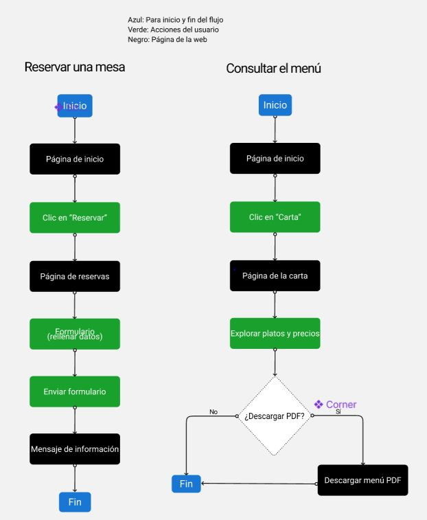
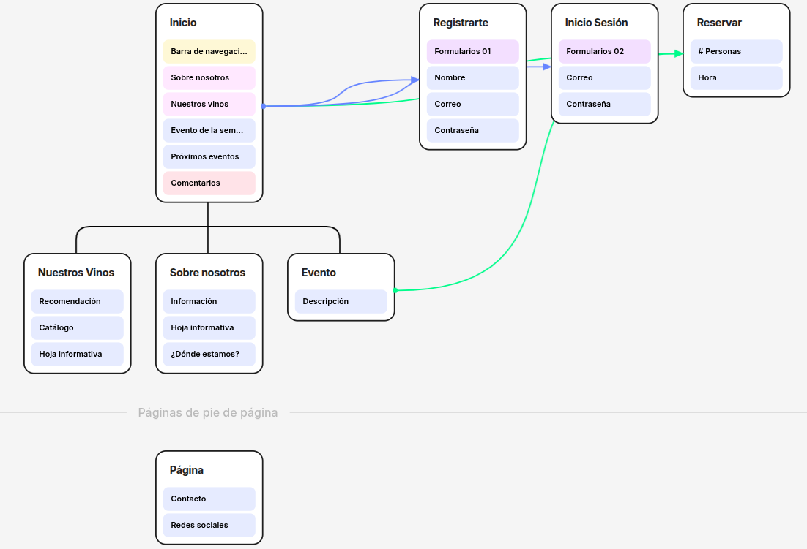
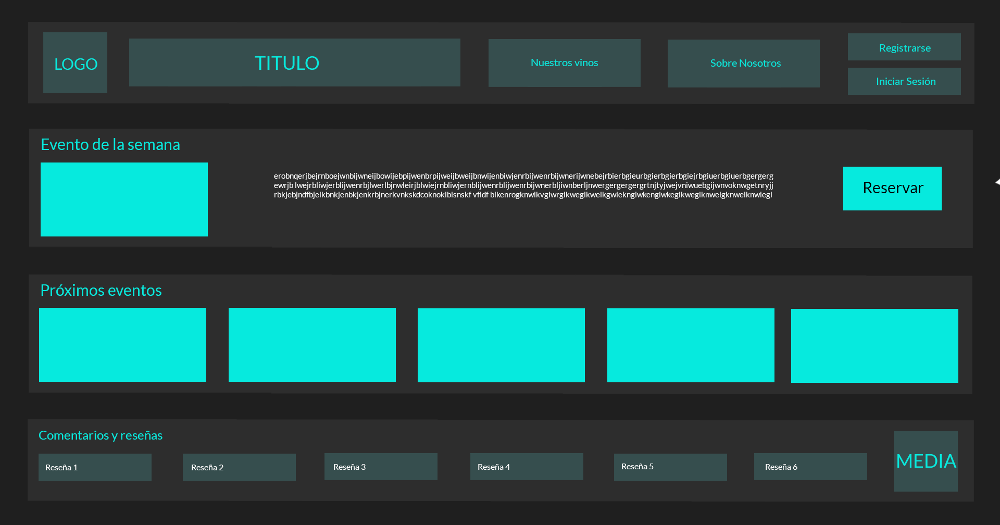
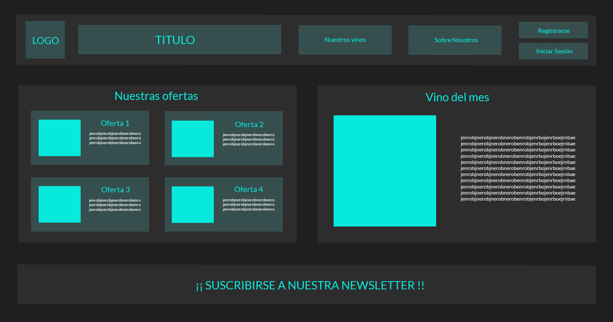
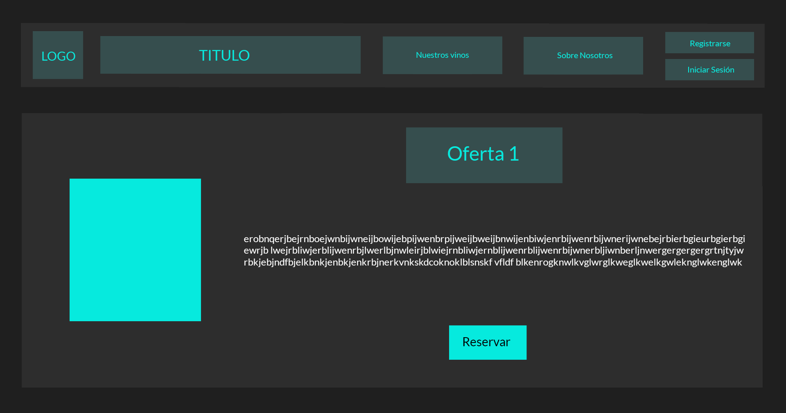
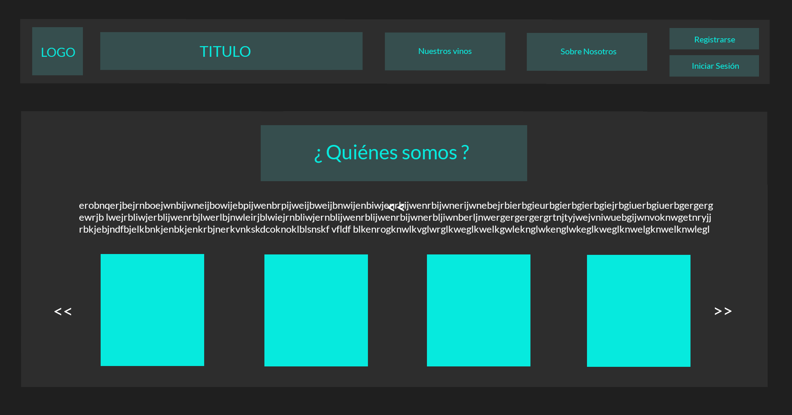
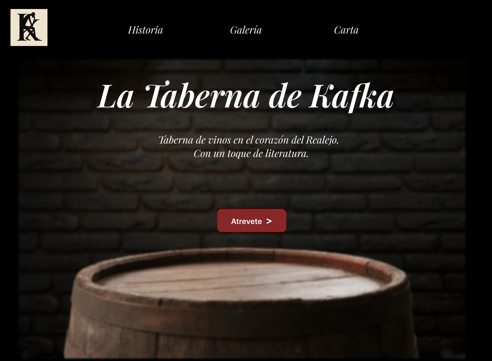

# DIU25
Prácticas Diseño Interfaces de Usuario (Tema: .... ) 

[Guiones de prácticas](GuionesPracticas/)

Grupo: DIUx_AABB.  Curso: 2024/25 

Actualizado: xx/xx/2025

Proyecto: 

>>> Decida el nombre corto de su propuesta en la práctica 2 

Descripción: 

>>> Describa la idea de su producto en la práctica 2 

Logotipo: 

>>> Si diseña un logotipo para su producto en la práctica 3 pongalo aqui, a un tamaño adecuado. Si diseña un slogan añadalo aquí

Miembros:
 * :bust_in_silhouette:  Isaaac Torres García    :octocat:    https://github.com/IsaacTorres97 
 * :bust_in_silhouette:  Sergio Albacete Martin     :octocat:  https://github.com/sergioam20

>>> Los equipos son de 2 personas. Identifícaros con el nombre del Grupo y los enlaces a los perfiles de GitHub de cada integrante

>>> Este documento es el esqueleto del Case Study que explica el proceso de desarrollo de las 5 prácticas de DIU. Aparte de subir cada entrega a PRADO, se debe actualizar y dar formato de informe final a este documento online. Elimine este tipo de texto / comentarios desde la práctica 1 conforme proceda a cada paso

# Proceso de Diseño 

 

## Paso 1. UX User & Desk Research & Analisis 

### 1.a User Reseach Plan
 
-----

Para comprender más acerca del negocio al cual ayudaremos con su experiencia de usuario necesitaremos conocer un variedad de aspectos como puede ser en donde se encuentra ubicado, cuales son las actividades que ofrecen y como estas mejoran la experiencia gastronómica de sus clientes. Conociendo lo anterior podremos enfocar mejor el cliente prototípico al que puede, y quiere,  llegar el negocio en cuestión para de esa manera preparar la mejor experiencia de usuario posible acorde a su perfil y necesidades.
Para recopilar información acerca del negocio usaremos principalmente la información que encontremos en internet del mismo como pueden ser: página web, redes sociales, artículos en periódicos. Además nos podemos acercar al lugar en cuestión para recopilar información con respecto al espacio físico que ocupa, donde está ubicado, como está decorado, sus actividades se desarrollan al aire libre o no y fijarse en las personas que transcurren en ese momento al sitio. Aunado a esto probar la la experiencia ofrecida por el negocio sería de muy alto valor a la hora de conocer el producto y saber a quién está dirigido.
 

### 1.b Competitive Analysis
 
-----
-Información de producto
-Estrategia de marketing
-Gestión de Reservas
-Contacto con el cliente

### 1.c Personas
 
-----

Laura es una persona jóven, creativa y apasionada de la tecnología (redes sociales y edición de video)  que trabaja como CM de una cafetería de Granada. Apasionada también por la gastronomía local.

Carlos es un hombre adulto que vive con su esposa con la que le gsuta viajar y probar sitios y experiencias nuevas, desde qeu sus hijos han dejado la casa siente qeu si vida en pareja es muy monotona.

### 1.d User Journey Map
 
----

Me  parece que son dos perfiles adecuados y reales a lo que podríamos encontrar hoy en día.

### 1.e Usability Review
 
----

La valoración obtenida ha sido: 59(Moderate)

 

El el caso de La Taberna de Kafka que no tiene una página web, ya que es un negocio que no necesita de la misma porque es boca a boca le ha hecho de una reputación, el análisis se ha limitado a las redes sociales y a los espacios que tiene en buscadores como TripAdvisor. Dentro de este análisis podemos resaltar como el negocio se enfoca en la redes sociales (instagram y facebook) para transmitir su esencia a sus posibles clientes, esto crea una mayor cercanía con los clientes que ya los conocen pero no facilita el acceso o el acercamiento de potenciales clientes. La información más básica como la ubicación del sitio, una descripción de sus productos y experiencias se puede encontrar de forma escueta en sus páginas en redes sociales pero se complica un poco más la interacción con los usuarios que quieran disfrutar de sus experiencias, y  más aún cuando estos no son diestros de las redes, a la hora de reservar o conocer con mayor detalle de que tratan sus eventos y cómo acceder a los mismos.

## Paso 2. UX Design  

>>> Cualquier título puede ser adaptado. Recuerda borrar estos comentarios del template en tu documento

### 2.a Reframing / IDEACION: Feedback Capture Grid / EMpathy map 
 
----

 Interesante | Críticas     
| ------------- | -------
  Preguntas | Nuevas ideas
  

Problema Detectado: La investigación inicial reveló varios pain points. Los usuarios
interesados en Taberna Kafka tenían dificultades para encontrar información actualizada:
la carta no estaba accesible fácilmente, la localización y horario sólo aparecían en textos
de redes sociales, y no había un canal formal para reservas o consultas. La presencia
online no reflejaba el carácter especial de la taberna ni generaba confianza plena en
nuevos clientes. También se detectó que competidores directos (otras tabernas de la
zona) ya cuentan con sitios web sencillos donde muestran su menú y permiten contacto
inmediato, lo que pone a Taberna Kafka en desventaja.
    
>>> Explica el Problema y plantea una hipótesis. Es decir, explica aquí qué 
>>> se plantea como "propuesta de valor" para un nuevo diseño de aplicación propio

La página web de 'La Taberna de Kafka' transforma la relación con los clientes al ofrecer una experiencia digital que complementa y potencia la magia del restaurante. Con herramientas prácticas como reservas en línea, reseñas interactivas y un diseño inspirado en Kafka, el sitio web no solo facilita la planificación de visitas, sino que también conecta emocionalmente con los clientes, expande el alcance del negocio y refuerza su identidad única.

### 2.b ScopeCanvas

----

>>> Propuesta de valor, pero ahora en vez de un texto es un ScopeCanvas que has subido a P2/ y enlazado desde aqui. Tambien vale una imagen miniatura del recurso.
>>> No olvides que tu propuesta ya tiene un nombre corto y puedes actualizar la cabecera de este archivo

### 2.b User Flow (task) analysis 
 
-----

>>> Definir "User Map" y "Task Flow" ... enlazar desde P2/ y describir brevemente

### 2.c IA: Sitemap + Labelling 
 
----

>>> Identificar términos para diálogo con usuario (evita el spanglish) y la arquitectura de la información. Es muy apropiado un diagrama tipo sitemap y una tabla que se ampliaría para llevar asociado la columna iconos (tanto para la web como para una app). 

Término | Significado     
| ------------- | -------
  Login  | acceder a plataforma
  Registrase | registrase en la plataforma
  Inicio | lleva a la página principal
  Nuestros vinos | te lleva al catalogo de vinos
  Sobre nosotros | información del restaurante
  Reservar | crea una reserva
  Suscribirse | te suscribe en la newsletter
  Cometar | crea un comentario en las reseñas

### 2.d Wireframes

-----

Página de inicio

Página del catalogo de vinos junto con la recomendación del mes

Página genérica con la informacion de los eventos de catas

Página con la información del restaurante

 

## Paso 3. Mi UX-Case Study (diseño)
>>>UX-Case Study de La taberna Kafka
### 3.a Moodboard

-----

Hemos utilizado milanote para organizar el moodboard y apoyandodnos en paleton para elegir la paleta de colores adecuada para el UX del proyecto,adicionalmente hemos probado las fuentes y como su diseño se adecua a lo que buscabamos en fonts de google.
No podemos usar la imagen para cabecera de instagram ya que contiene cosas como los colores y las fuentes que no estan alineadas con el conteniido que puede ser adecuado para esa plataforma, haciendo algunos cambios se podria usar para esa finalidad pero sería mejor utilizar otras imagenes o alguna qeu ya forma parte del moodboard.

### 3.b Landing Page
 

Para el landing apge hemos mantenido una estética sobria utilizando la paleta de colores planteada anteriormente en el moodboard, usamos una imagen atenuada de un barril que representa el espiritú por el vino que tiene la taberna y sobre esa imagen central hemos puesto el botón que redirige a la web con la finalidad de que sea lo que llame la atención al observador.

### 3.c Guidelines
 

Identidad Visual
Para mantener coherencia visual y reforzar la imagen de marca, se ha definido una paleta de colores basada en tonos oscuros que transmiten elegancia y sencillez. Se utiliza el negro como color principal del fondo, combinado con texto blanco para mejorar la legibilidad. Como color de llamada a la acción (CTA) se ha elegido un rojo intenso, que resalta sin saturar la interfaz.

La tipografía empleada es sans serif, clara y fácil de leer tanto en dispositivos móviles como en escritorio. Los títulos son destacados en negrita, mientras que el cuerpo de texto mantiene un peso normal.

Estructura General del Layout
El diseño sigue una estructura limpia y organizada, dividida en bloques verticales que facilitan la navegación. El encabezado contiene el logo y el menú de navegación, ubicado en la parte superior izquierda y derecha respectivamente. A continuación, se presenta la sección principal (hero section), donde se muestra la cata de vinos más destacada, incluyendo título, detalles e imagen representativa.

Bajo esta sección se encuentran otros eventos disponibles los cuales se presentan en formato de carousel, comentarios de usuarios y datos de contacto. Finalmente, en el pie de página, se repite la información de contacto para facilitar su acceso.

Tarjetas de cata: Cada evento se muestra en forma de tarjeta con imagen, título, fecha, hora, precio y botón de reserva. Este patrón permite mostrar la información de manera ordenada y visualmente atractiva.

Interacción y Estados
Los elementos interactivos, como los botones, cambian ligeramente su apariencia al pasar el ratón por encima o al ser seleccionados, ofreciendo retroalimentación visual al usuario. En los formularios, se muestran mensajes claros ante errores o confirmaciones exitosas, ayudando al usuario a comprender el estado de la acción realizada.

Navegación
La barra de navegación se encuentra siempre visible en la parte superior, con opciones accesibles desde cualquier sección. En dispositivos móviles, se utiliza un menú hamburguesa que despliega las opciones principales sin sobrecargar la pantalla.

Consideraciones Finales
Este documento sirve como guía inicial para el desarrollo del prototipo web de "La Taberna de Kafka". Se han identificado patrones de diseño comunes, colores, tipografías y estructuras que permitirán mantener la coherencia visual y funcional durante todo el proceso. Esta base puede ser revisada y ajustada conforme avance el proyecto y se obtenga feedback de usuario.

### 3.d Mockup
 
Pincha abajo para accedeer al mockup de nuestra aplicación

https://www.figma.com/design/7OoLiCMAsjJl7QleOEN71M/Kafka-landing?node-id=17-7&p=f&t=Bz4TEWxMxAHdgLXZ-0
----

>>> Consiste en tener un Layout en acción. Un Mockup es un prototipo HTML que permite simular tareas con estilo de IU seleccionado. Muy útil para compartir con stakeholders

### 3.e ¿My UX-Case Study?
 
-----

>>> Publicar my Case Study en Github... Es el momento de dejar este documento para que sea evaluado y calificado como parte de la práctica
>>> Documente bien la cabecera y asegurese que ha resumido los pasos realizados para el diseño de su producto

 

## Paso 4. Pruebas de Evaluación 

### 4.a Reclutamiento de usuarios 

-----

>>> Breve descripción del caso asignado (llamado Caso-B) con enlace al repositorio Github
>>> Tabla y asignación de personas ficticias (o reales) a las pruebas. Exprese las ideas de posibles situaciones conflictivas de esa persona en las propuestas evaluadas. Mínimo 4 usuarios: asigne 2 al Caso A y 2 al caso B.

| Usuarios | Sexo/Edad     | Ocupación   |  Exp.TIC    | Personalidad | Plataforma | Caso
| ------------- | -------- | ----------- | ----------- | -----------  | ---------- | ----
| User1's name  | H / 18   | Estudiante  | Media       | Introvertido | Web.       | A 
| User2's name  | H / 18   | Estudiante  | Media       | Timido       | Web        | A 
| User3's name  | M / 35   | Abogado     | Baja        | Emocional    | móvil      | B 
| User4's name  | H / 18   | Estudiante  | Media       | Racional     | Web        | B 

### 4.b Diseño de las pruebas 
 
-----

>>> Planifique qué pruebas se van a desarrollar. ¿En qué consisten? ¿Se hará uso del checklist de la P1?

### 4.c Cuestionario SUS
 
----

>>> Como uno de los test para la prueba A/B testing, usaremos el **Cuestionario SUS** que permite valorar la satisfacción de cada usuario con el diseño utilizado (casos A o B). Para calcular la valoración numérica y la etiqueta linguistica resultante usamos la [hoja de cálculo](https://github.com/mgea/DIU19/blob/master/Cuestionario%20SUS%20DIU.xlsx). Previamente conozca en qué consiste la escala SUS y cómo se interpretan sus resultados
http://usabilitygeek.com/how-to-use-the-system-usability-scale-sus-to-evaluate-the-usability-of-your-website/)
Para más información, consultar aquí sobre la [metodología SUS](https://cui.unige.ch/isi/icle-wiki/_media/ipm:test-suschapt.pdf)
>>> Adjuntar en la carpeta P4/ el excel resultante y describa aquí la valoración personal de los resultados 

### 4.d A/B Testing
 
-----

>>> Los resultados de un A/B testing con 3 pruebas y 2 casos o alternativas daría como resultado una tabla de 3 filas y 2 columnas, además de un resultado agregado global. Especifique con claridad el resultado: qué caso es más usable, A o B?

### 4.e Aplicación del método Eye Tracking 

----

>>> Indica cómo se diseña el experimento y se reclutan los usuarios. Explica la herramienta / uso de gazerecorder.com u otra similar. Aplíquese únicamente al caso B.

  
>>> Cambiar esta img por una de vuestro experimento. El recurso deberá estar subido a la carpeta P4/  

>>> gazerecorder en versión de pruebas puede estar limitada a 3 usuarios para generar mapa de calor (crédito > 0 para que funcione) 

### 4.f Usability Report de B
 
-----

>>> Añadir report de usabilidad para práctica B (la de los compañeros) aportando resultados y valoración de cada debilidad de usabilidad. 
>>> Enlazar aqui con el archivo subido a P4/ que indica qué equipo evalua a qué otro equipo.

>>> Complementad el Case Study en su Paso 4 con una Valoración personal del equipo sobre esta tarea

 

## Paso 5. Exportación y Documentación 

### 5.a Exportación a HTML/React
 
----

>>> Breve descripción de esta tarea. Las evidencias de este paso quedan subidas a P5/

### 5.b Documentación con Storybook

----

>>> Breve descripción de esta tarea. Las evidencias de este paso quedan subidas a P5/

 

## Conclusiones finales & Valoración de las prácticas

>>> Opinión FINAL del proceso de desarrollo de diseño siguiendo metodología UX y valoración (positiva /negativa) de los resultados obtenidos. ¿Qué se puede mejorar? Recuerda que este tipo de texto se debe eliminar del template que se os proporciona 

