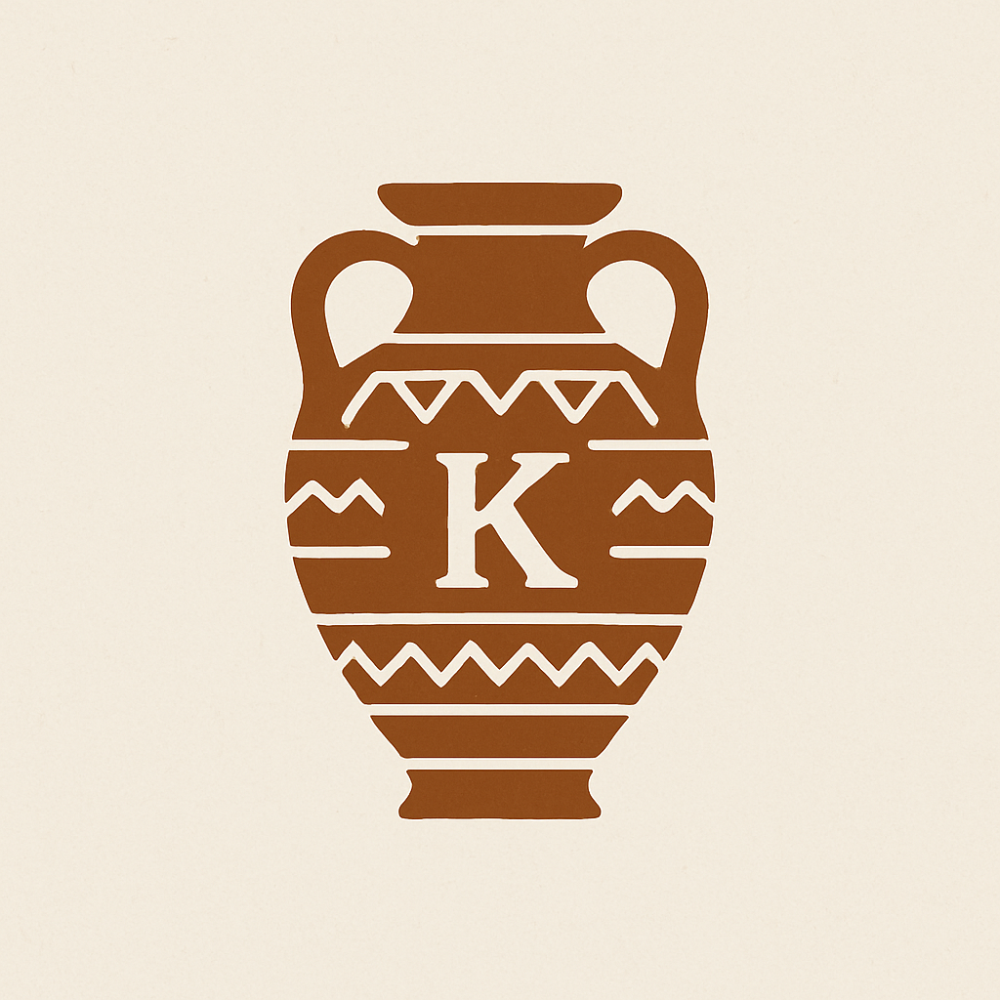

# Usability Report

## Evaluación de usabilidad del proyecto "Tu huella en la cerámica"

## 30-05-2025

![GitHub del proyecto(https://github.com/DIU3-TheLastDance/UX_CaseStudy)]

### Realizado por:
Informe realizado por equipo PardeDos del grupo 2 de los viernes compuesto por Sergio Albacete Martín e Isaac Emilio Torres García.
Después de realizar estos informes, hemos ganado experiencia en análisis de usuarios, creación de prototipos funcionales, evaluación heurística y pruebas de usabilidad (test SUS).

## 1 DESCRIPCIÓN DEL WEBSITE
El proyecto tiene como objetivo rediseñar la interfaz web de una tienda de cerámica artesanal, optimizando la experiencia del usuario en cuanto a navegación, estética y funcionalidad, tanto en desktop como en móvil. 
Nuestros compañeros han intentado mejorar la claridad en la presentación de productos, la facilidad de compra y la conexión emocional con el producto artesanal.

## 2 RESUMEN EJECUTIVO
Hemos recogido resultados del Test de usabilidad sobre el prototipo funcional del sitio web, evaluado mediante el cuestionario estandarizado SUS.

Se identificó una experiencia del nivel casi marginal D con una puntuación media de 56,25/100.
En nuestra investigación, hemos encontrado mayormente ciertos problemas relacionados con la dificultad de encontrar el cómo añadir una pieza al carrito y también con respecto al panel de abajo que encontramos para logearnos (lo cual hubiese estado mejor en la parte de arriba de la pantalla al lado del menú), el carrito y el menú que lleva directamente al catálogo, ya que hubiese estado mejor incorporar ese panel al completo en el menú superior que tenemos al lado del logo, junto con el contacto, los talleres...

Con respecto al botón para personalizar un carrito, hemos visto más lógico que este se encontrase en la parte de arriba del catálogo, ya que sería una opción más visible y más usada, ya que se vería con más claridad a la hora en la que el cliente está viendo el catálogo, ya que en ese momento le interesaría más ver el botón de personalizar jarrón.

En general, es una app bastante correcta, pero hemos considerado las anteriores mejoras a considerar por las cuáles ha surgido la nota media relativamente "baja" del cuestionario SUS.

## 3 METODOLOGIA 

#### Metodología de usabililidad
Hemos usado varias herramientas para valorar la experiencia del usuario, entre ellas, Maze Testing, para valorar algunas preguntas generales sobre el tema de la web y sobre la interfaz de la app. 

También hemos usado cuestionarios de Google con preguntas específicas y valoraciones del 1 al 5 para obtener los resultados del cuestionario SUS.

#### Test de usuarios: Participantes
Se llevó a cabo una prueba de usabilidad moderada en la que participaron usuarios representativos del público objetivo. Cada sesión fue individual y presencial, con un facilitador guiando al participante a través de un conjunto de tareas típicas en el sitio web.

| Participante | Género | Edad | Experiencia con e-commerce  |
|--------------|--------|------|-----------------------------|
| Álvaro       | Hombre | 21   | Alta                        |
| Víctor       | Hombre | 26   | Media                       |

#### Resultados obtenidos

(resultado de SUS)

(resultado de eyetracking)

## 4 CONCLUSIONES 

(qué podemos extraer de conclusion con las pruebas de usabilidad efectuadas)

#### Incidencias

* (indicad si algo ha fallado o no se ha podido realizar correctamente por algún motivo)

#### Valoración 

* (Puntos Positivos a destacar)

#### Recomendaciones y propuesta de mejoras: 

* (Puntos de mejora)

#### Valoración de la prueba de usabilidad (self-assesment)

(valoración personal de si han sido útiles estas técnicas para detectar errores ocultos o falllos de usabilidad en este caso )
